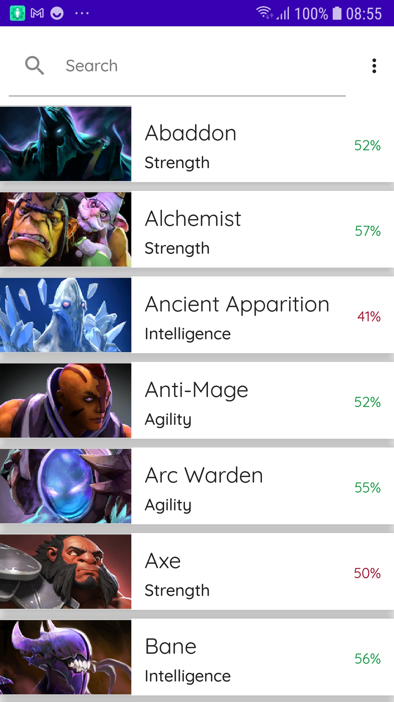
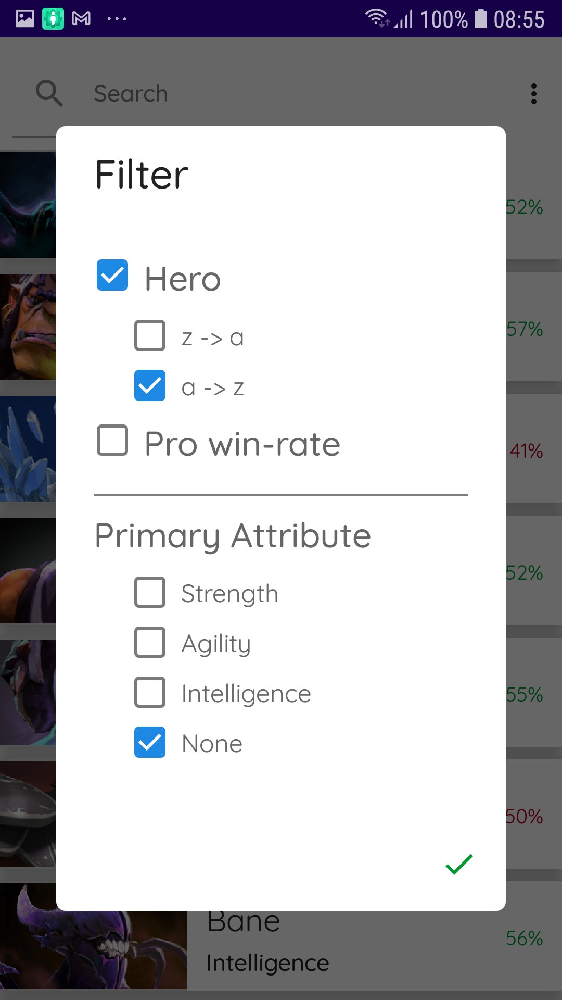
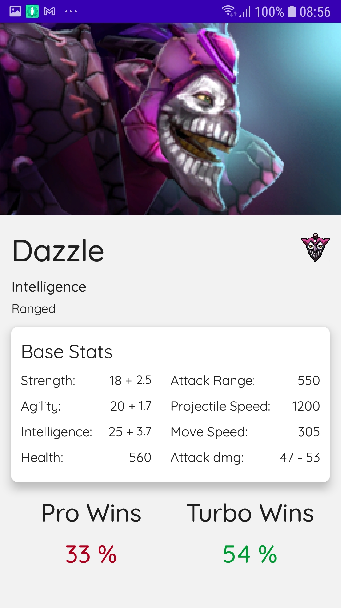

# Dota-World
App where the user can browse Dota heros and check their details

## The Brief

App that searches characters from the dota api

## Architecture & Libraries
    - Clean Architecture
    - MVI
    - Multi-module
    - Compose
    - Ktor (Network)
    - SQL Delight (Caching)
    - Coil (Image Caching)
    - Unit Tests
    - UI Testing with Compose
    - Hilt Dependency Injection
    - Testing with Hilt
    - Building an "offline first" application

## App preview:

Image #1            |  Image #2             |  Image #3
:-------------------------:|:----------------------------:|:----------------------------:
    |       |   
